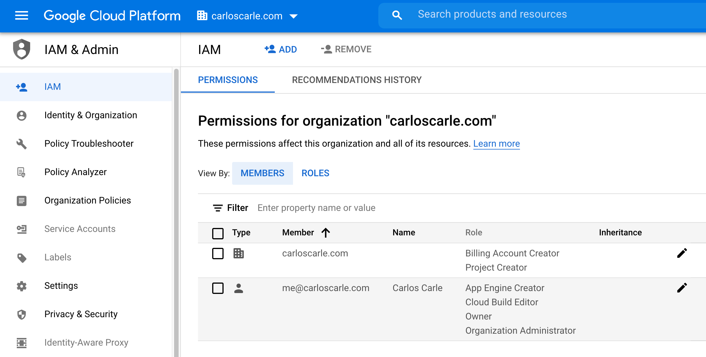
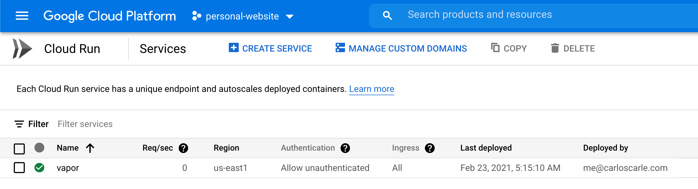
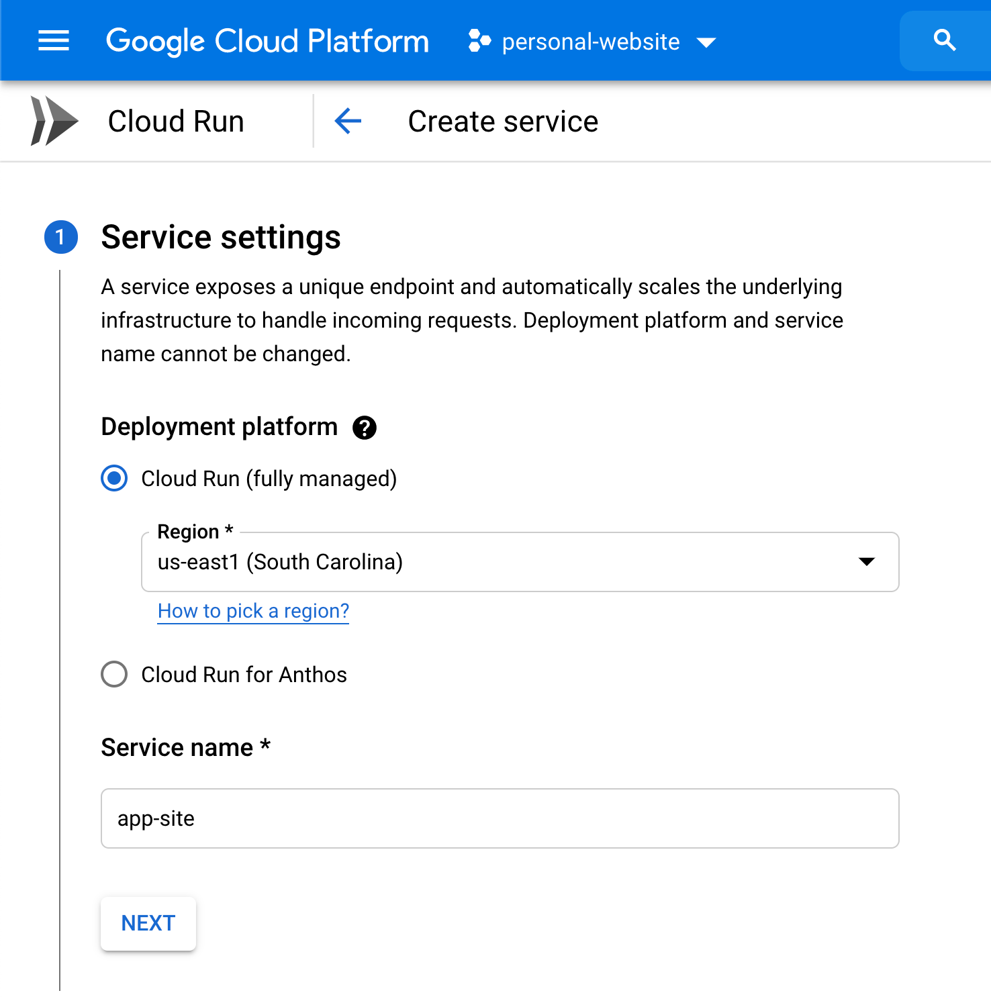
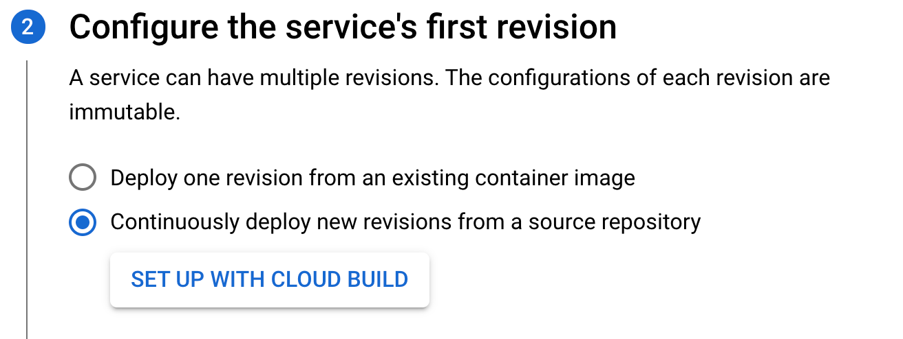
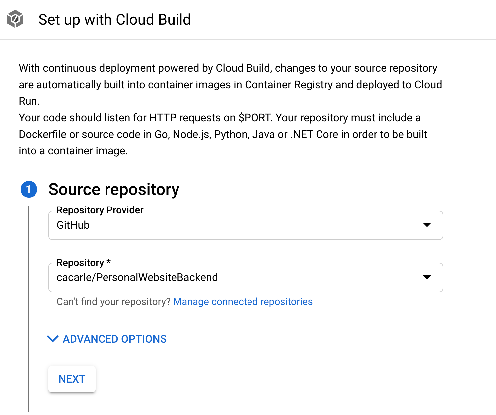
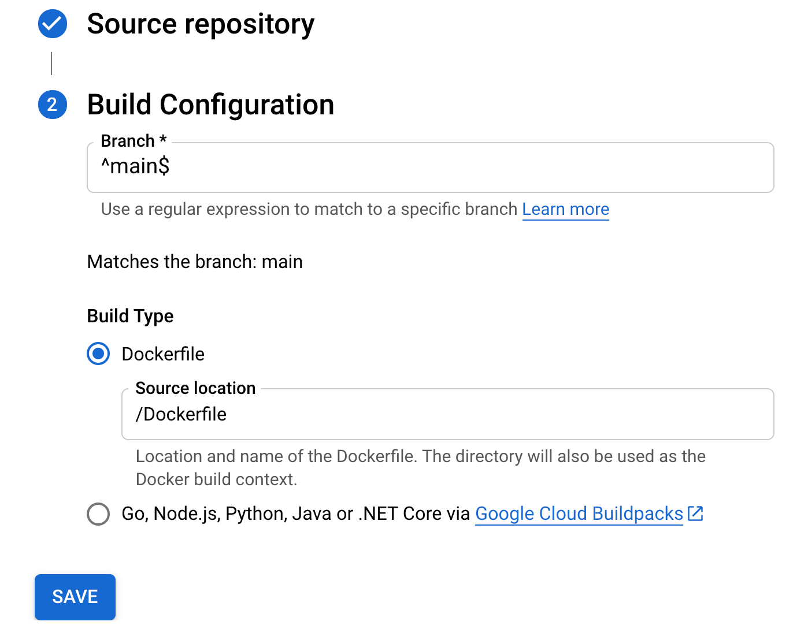
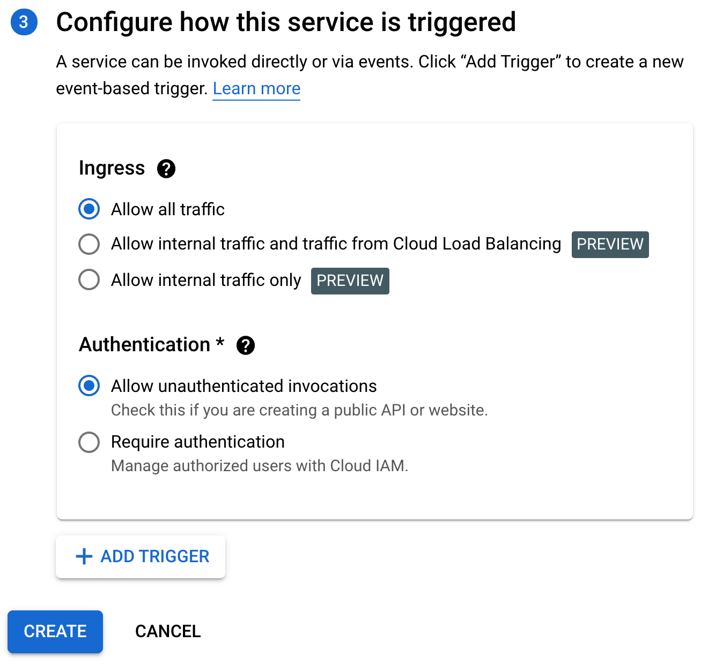
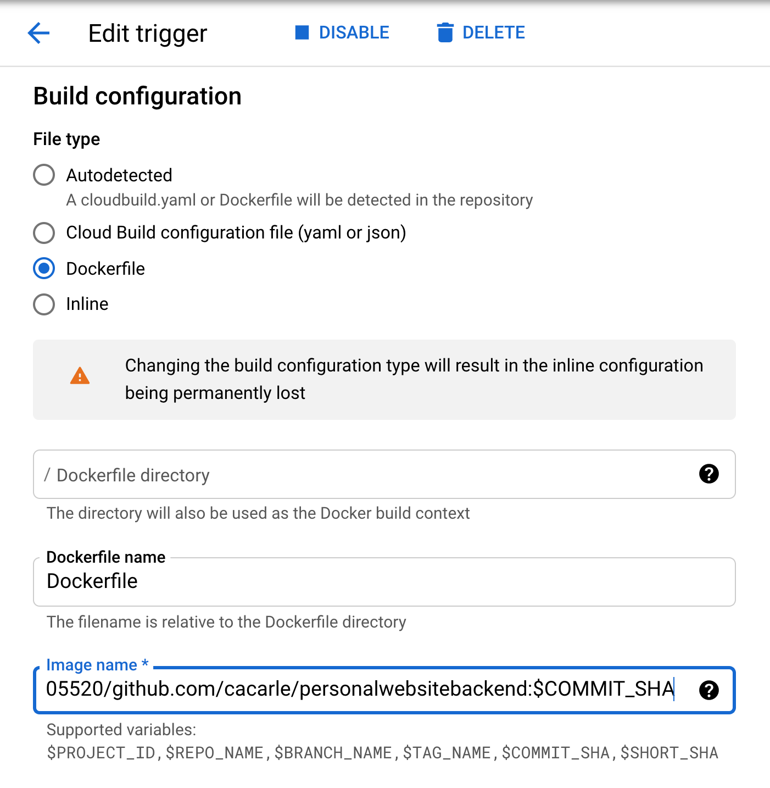
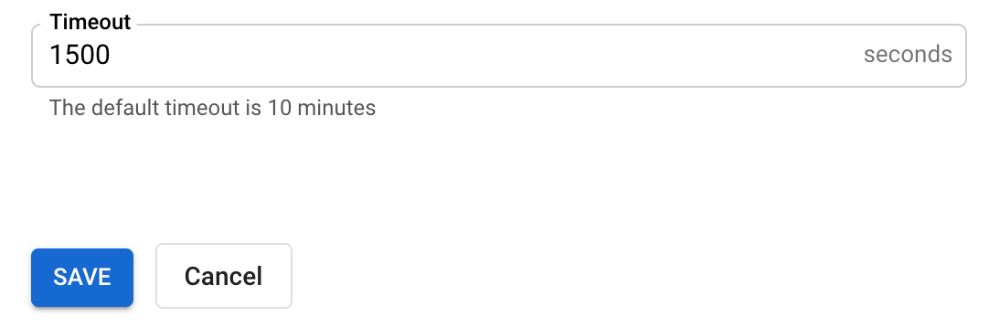

The guts of my small personal site ⚙️
=======
My relatively simple worfklow for deploying a server-side Swift app on the cloud with on-demand provisioning using Vapor + Leaf-Tau/Bootstrap + Docker + GCP Run. [Link](carloscarle.com)


## Vapor app 💧

### /Package.swift

I chose to use the Tau branch of Leaf as it currently has more documentation and features. For simple websites like this one either should work just fine.

```swift
// swift-tools-version:5.3
import PackageDescription

let package = Package(
    name: "PersonalWebsiteApp",
    platforms: [
       .macOS(.v10_15)
    ],
    dependencies: [
        // 💧 A server-side Swift web framework.
        .package(url: "https://github.com/vapor/vapor", from: "4.32.0"),
        .package(url: "https://github.com/vapor/leaf", .exact("4.0.0-tau.1")),
        // .package(url: "https://github.com/vapor/leaf-kit", .exact("1.0.0-tau.1.1")),
    ],
    targets: [
        .target(name: "App", dependencies: [
            .product(name: "Leaf", package: "leaf"),
            .product(name: "Vapor", package: "vapor"),
        ]),
        .target(name: "Run", dependencies: ["App"]),
        .testTarget(name: "AppTests", dependencies: [
            .target(name: "App"),
            .product(name: "XCTVapor", package: "vapor"),
        ])
    ]
)
```

### /Sources/App/configure.swift

Here we're essentially telling Vapor's file middleware to access the Public folder and configure Leaf's `LeafEngine` to look for templates there, disable caching and directory indexing, and to set HTML files as the default.

```swift
public func configure(_ app: Application) throws {
    
    // Disabling renderer caching for Leaf allows you to change the templates (HTML and CSS files in this case) without having to restart the server
    if !app.environment.isRelease { LeafRenderer.Option.caching = .bypass }
    
    // Without directory indexing you can't make a request to '/ which is what you want so you can access 'website.com'
    LeafFileMiddleware.directoryIndexing = .ignore
    
    // So leaf knows where to look for the templates
    let detected = LeafEngine.rootDirectory ?? app.directory.viewsDirectory
    
    LeafEngine.rootDirectory = detected
    // Tells Leaf details about how to handle files, such as letting us deal with normal HTML files rather than .leaf files that make it easier for syntax coloring
    LeafEngine.sources = .singleSource(NIOLeafFiles(fileio: app.fileio,
                                                    limits: .default,
                                                    sandboxDirectory: detected,
                                                    viewDirectory: detected,
                                                    defaultExtension: "html"))
    
    if let lfm = LeafFileMiddleware(publicDirectory: app.directory.publicDirectory) {
        app.middleware.use(lfm)
    }
    
    app.views.use(.leaf)
    try routes(app)
}
```

### /Sources/App/routes.swift

We need to set up one route so the user can send a GET request to the server so it can in turn serve the page. We can include a context variable to inject JSON-style values into the Leaf templates. In this case we're just passing on the title.

```swift
func routes(_ app: Application) throws {
    
    app.get { req in
        req.leaf.render(template: "index", context: [
            "title": "Carlos Carle 👨‍💻",
        ])
    }
}
```

### /Public

This folder contains the resources a normal HTML website would need. In this case it's just a css folder containing styles.css and an img folder with the banner picture. We'll give Vapor access to this folder in the configure.swift

### Resources/Views

This folder is where Leaf expects to see the HTML files according to our `configure.swift`.

## Leaf Templates 🍃

Normally you would use `.leaf` files which are the same as a normal HTML (and CSS, etc.) file but with added Leaf-syntax. However we can just tell Leaf to use HTML in `configure.swift` and to find them in the Views directory as is convention.

I simply used the `inline#("html", as: raw)` to render some of the content separately and have it come together when a request is made rather than just having a large and messy HTML file. Although this is sufficient for the needs of this particular website, it is by far not one of the coolest things that can be done with Leaf-Tau. At the end I go over what I'm planning to add later on. Also, to access the title variable in a template just use `#(title)`.

## Deploying on Google Cloud Run ☁️

### Initial Setup

If you just want to deploy one revision of your server to GCP Run and update it manually then steps 2-5 of this [Google Dev Codelab](https://codelabs.developers.google.com/codelabs/cloud-run-deploy/#0) are most of what's needed to get set up before pointing the service to your domain. This approach assumes that you have a GitHub repository that you can `git clone` to get the files into Cloud Shell. If you don't have one or are having trouble working with a private one, another way could be to install the GCP SDK on your computer and feed local files to GC Build or even setting up a bucket and uploading the files to that so you can access them in the GC Console (I haven't tried out these ways but it's what I would do if this didn't work).

I set up a build trigger so that every time I make a push to the repository it creates a build. This can be done in a matter of minutes on the GCP web portal. Before doing this I created an organization with the website domain which in turn creates a new account that I set up with the email that I created for the domain. You also need to set up a Cloud Identity, activate billing (I used the free $300 compute credits trial), and manage some permissions like so:



...otherwise your build may get stuck on the submitting process because you don't have the permissions to get it through

### Deploying

Head to the [GCP Console](console.cloud.google.com) and type Cloud Run on the search bar and go inside the project. Click on "Create Service".



Pick a region that supports triggers and give the service a name.



In step 2 mark choose the second option and click "Set up with cloud build".

 

Connect your GitHub repository through the GitHub web app that pops up. For some reason the authentication would not do anything until I accessed the site in Incognito Mode 🤷‍♂️ (so try that if you're getting stuck in this step).



Choose the branch (or leave as is in this case) and specify where the Dockerfile is in relation to the repo folder.



Finally, for step 3 make sure that you allow all traffic and unauthenticated invocations (since we're just servince a static website). Click "Create".



It will fail to build initially as it seems that the inline file that it crates needs modification. If you don't want to deal with this and just have builds get created and then you go in and deploy them manually (the half-lazy way) then just follow this next step. Once I figure out how to get that working properly I'll update this repo. For now, click on "Edit Continuous Deployment" and change the build configuration to `Dockerfile`. 



Also change the timeout settings to something longer because the default 10 minutes will not be enough. This build usually takes 19min on a 1 CPU build instance, so 25min is plenty (you're paying for it anyway).



Let's test it by pushing a commit to the repository to trigger the first build! 

More details coming...

### Troubleshooting Tips

## Improvements 👨‍💻

The web front-end portion of the website could use some work (especially for mobile). Since it was my first time writing HTML/CSS and Bootstrap for that matter, I decided to forgo modifying a preexisting template so I could learn it the 'hard way' and have a better foundation for other sites to come. I'm sure glad that lesson is over.

Also you might have noticed a Helper.swift file and some JSON in the Public folder that aren't being used. I am working on implementing a method to read those JSON, parse them with the structs inside Helper.swift, and use them to feed Leaf-friendly data to the templates. The only thing missing to get that working was implementing `fileio` separately, which has proven to not be as straightforward as it seems in Vapor/NIO.